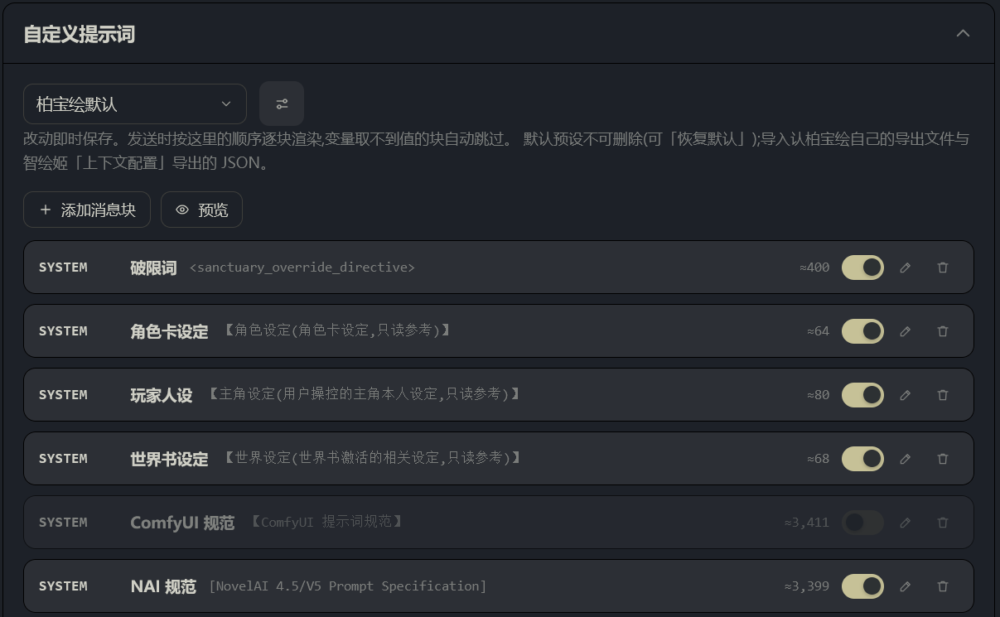
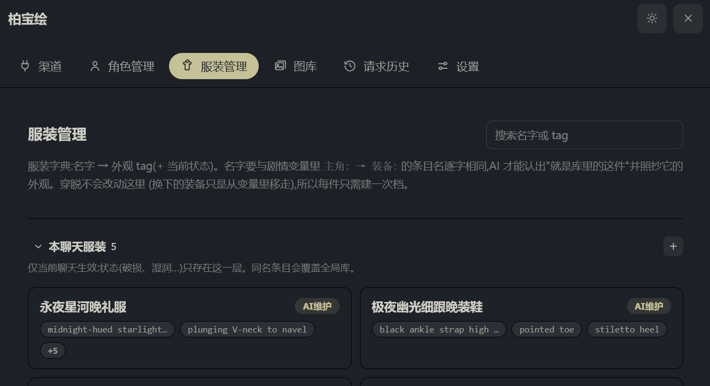
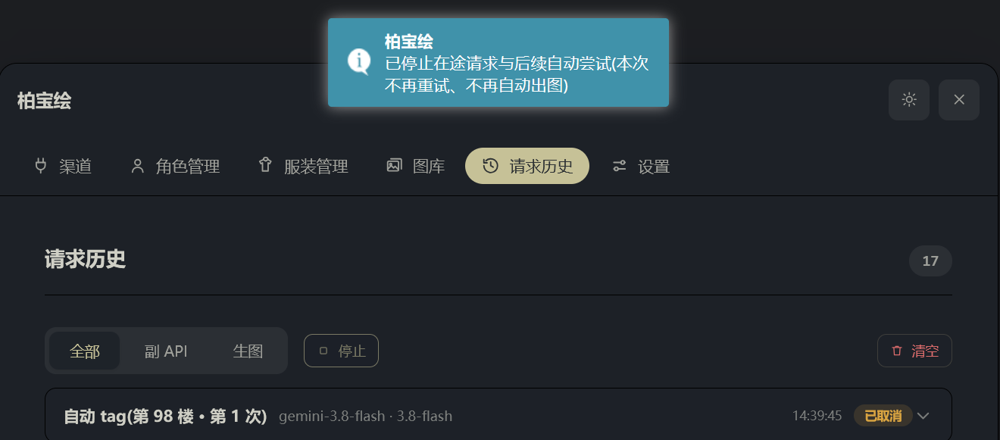
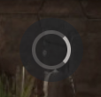

# 柏宝绘mk个人改版fork

**来源与授权**：本项目是 [baibai-git/ST-BaiBai-Image](https://github.com/baibai-git/ST-BaiBai-Image) 的个人改版分支（非官方 fork），原项目的著作权与署名归原作者柏柏所有

本分支的姿态是**非官方、非商业、不改署名**。若原作者对分享有任何异议（要求指定许可证、补充署名方式，或要求撤下），请在本仓库提 issue 或联系我，我会**立即照办**（转私有或删除）。

**插件原有功能的说明 —— 安装、ComfyUI / NovelAI 渠道、角色外貌库、图库等 —— 见[上游 README](https://github.com/baibai-git/ST-BaiBai-Image#readme)**，本文件不重复它们。

**本文件只写本分支相对上游的改动**：每条按「原版什么样 / 现在什么样 / 为什么改」，并附 git 依据（提交哈希 · 文件 · `architecture.md` 章节），可逐条核对。更深的设计理由见 `architecture.md`，第三方接口契约见 `PUBLIC_API.md`。

本版本号：`0.3.0-mk.0.5.35`

---

## 概览

| 模块 | 原版 | 本版本 |
|---|---|---|
| 提示词 | 6 个固定字段可编辑，消息顺序写死在代码里 | **18 条可自由排列的消息块 + 多预设**，可改角色/顺序/开关，支持变量、酒馆宏、预览、导入导出 |
| 服装 | 无（同一件衣服每次由 AI 重新描述） | **服装库**：名字对档的「服装名 → 外观 + 状态」字典，AI 自动建档，独立管理页（对档依赖剧情变量，见 §2.1 适用范围） |
| 中断 | 请求发出后只能等 | **「停止」按钮**：一次按停四条链路；悬浮球显示运行中 |
| 图库 | 逐张勾选 | 「选中当前 / 反选 / 全选」+ 拖缩略图直接另存 |
| 灯箱 | 一次一张 | **A/D 翻页 + S 切信息框**；楼层卡片按角色目录翻页 |
| 请求历史 | 失败时看不到返回原文 | 返回段恒定显示，三种空态分清 |

---

## 1. 提示词系统：从「6 个固定字段」到「消息块 + 预设」

这是本版本最大的改动，也是理解其余改动的钥匙。

### 1.1 六个固定字段 → 18 条可编辑消息块

- **原版**：设置页「自定义提示词」是一张固定列表，只有 6 项（破限词、ComfyUI 规范、ComfyUI 思维链、NAI 规范、NAI 思维链、预填充），每项点开在一个弹窗里改全文，留空 = 回落内置默认。**发出去的消息顺序写死在代码里**：破限 → 角色卡 → persona → 世界书 → 后端规范 → 固定协议 → 思维链 → user → assistant 预填充。
- **现在**：默认预设是 18 条消息块：破限词、角色卡设定、玩家人设、世界书设定、ComfyUI 规范、NAI 规范、NAI 规范(4 系)、固定输出协议、ComfyUI 思维链、NAI 思维链、NAI 思维链(4 系)、记忆、角色外貌库、服装库、任务备注、上下文、目标正文、预填充。**每条都能改名、换角色（system/user/assistant）、调顺序、单独停用、删除，也能新增块** —— 谁在第几条、以什么身份发出去，由块决定，不再由代码决定。
- **为什么**：原来"消息顺序"是个用户既看不到也改不了的产品决策；想调整只能等上游改代码。块化之后这件事归用户，也让"某块内容不想要"从"整份规范删掉一段"变成"关掉一个开关"。
- **依据**：`fb93757` · `src/state/settings.ts`（`AutoTagPromptBlock` / `AutoTagPromptConfig` / `defaultPromptPreset()`）· `src/state/defaultPreset.ts`（18 块数据）· `architecture.md` §5「消息组装 = 消息块」

### 1.2 块内变量：16 个可引用变量

- **原版**：内容全由代码拼进消息；唯一可见的"宏"是 ComfyUI 规范里的 `{{nl}}`（编辑弹窗里点一下插入到光标处），其余一概不可见、不可用。
- **现在**：`{{变量}}` 一览（设置页「可用变量」列出名字与说明）——
  - **内容类 10 个**：`{{char_card}}` `{{persona}}` `{{world_info}}` `{{book_memory}}` `{{char_library}}` `{{outfit_library}}` `{{chat_context}}` `{{target_text}}` `{{target_role}}` `{{task_note}}`
  - **协议类 5 个**：`{{output_shape}}` `{{image_count_rule}}` `{{content_rule}}` `{{negative_rule}}` `{{character_rule}}`
  - **片段宏 1 个**：`{{nl}}`（生成自然语言规范）
  取不到的变量渲染为空串；**块引用的内容变量全部没值 → 整块不发**（沿用旧版"抓不到角色卡就不发那条消息"的口径）；片段宏不参与这个判定，否则关掉自然语言会把整份规范一起吞掉。
- **为什么**：让用户能写出"跟着当前设置走"的块，而不是把角色卡、世界书、目标正文复制粘贴进模板（那些内容每轮都不同，粘进去等于写死）。跳过判定则避免"引用了没值的变量 → 发一条空消息给模型"。
- **依据**：`fb93757` · `src/autoTag/promptVars.ts`（`PROMPT_VARIABLES` 16 条）· `src/autoTag/promptRender.ts`（`renderPresetBlocks()` 的三种跳过原因）· `architecture.md` §5 变量段

### 1.3 酒馆宏真正生效（副 API 渠道下也生效）

- **原版**：走副 API 渠道时请求由插件直接构造，**绕开了酒馆**，所以块里写 `{{roll 1999999}}`、`{{char}}`、`{{time}}` 这些酒馆宏会被原样发给模型（只有跟随主 API 时才由酒馆展开）。
- **现在**：块文本先过插件变量，再把结果交给 `getContext().substituteParams` 逐块展宏 —— **顺序不能反**（`{{char_card}}` 这类插件变量酒馆不认识，先给它只会被原样留下或吞掉）。展宏发生在"空块判定"之前：一个只剩 `{{roll}}` 的块展宏后就不空了。
- **为什么**：副 API 是常用路径，宏在这条路上"看起来能用其实不能用"是最坏的一种状态。
- **依据**：`e7f9ebc` · `src/autoTag/prompt.ts`（`buildAutoTagAssembly()` 取 `substituteParams` 传进渲染）· `src/autoTag/promptRender.ts`（`renderTemplate()` 的 `expandMacros`）· `architecture.md` §5「酒馆宏会被展开」

### 1.4 预览：发出去之前先看一眼

- **原版**：没有预览。只能盯着自己写的模板猜"实际发出去长什么样"，而消息组装还牵涉角色卡、世界书、角色库、最近 N 楼正文等一堆动态内容。
- **现在**：设置页「预览」用**当前聊天**走一遍真实装配（**纯本地**：不求 LLM、不写请求历史、不消耗额度、不改任何数据）：
  - 上半 = 合并后**真正会发出去的消息全文**（可一键复制全部）；
  - 下半 = 合并前的**逐块明细**，含被跳过的块与原因（已停用 / 内容为空 / 引用的变量都没有值）；
  - 会点名**展宏后仍残留的 `{{...}}`**（会原样发给模型：拼错的插件变量、没展开的酒馆宏）与**每次取值可能不同的宏**（`{{roll}}`/`{{random}}`/`{{pick}}`，说明看到的是这一次的值）；
  - 非阻断警告：例如"没有任何块输出 `{{output_shape}}` → 模型不知道返回什么结构，自动配图会解析失败"。
- **为什么**：提示词系统的自由度提高后，"我怎么知道它到底发了什么"必须有答案；拿真实请求去试错既费额度又慢。
- **依据**：`fb93757` + `e7f9ebc` · `src/autoTag/promptPreview.ts` · `src/pages/settings/PromptPreviewDialog.vue` · `architecture.md` §5

### 1.5 多预设：新建 / 另存为 / 重命名 / 删除 / 恢复默认

- **原版**：只有一套提示词，没有"预设"概念；想试另一套写法就得先备份文本。
- **现在**：整套消息块存成一份**预设**，可随时切换：新建、另存为（连每个块的 id 都换新，互不影响）、重命名、删除；**默认预设不可删**（界面不给入口，手改 `settings.json` 也会被兜回来）。「恢复默认」把默认预设的块恢复成内置默认。
- **依据**：`fb93757` · `src/autoTag/promptPreset.ts`（`newPromptPreset()` / `clonePreset()` / `canDeletePreset()`）· `src/pages/settings/PromptPresetSection.vue`

### 1.6 导入导出：自有格式 + 智绘姬预设兼容

- **原版**：无导入导出。
- **现在**：
  - **自有格式**：导出当前预设或全部预设为 `baibai-prompt-*.json`（`format: "baibai-prompt-presets"`，自包含；连"固定输出协议"块的内置标记一起带走，导入回来仍能用「恢复内置默认」）；
  - **兼容智绘姬**：可直接导入 st-chatu8「上下文配置」导出的 JSON（`{预设名: {entries: [...]}}`）。原本按**触发词**发送的条目导入为**停用** —— 本插件没有触发词能力，照搬 `enabled=true` 会让原本只在该关键词下才发的内容变成常开，静默改变行为；
  - 导入前有预览与警告摘要（哪条被丢弃、几条因触发模式被停用、重名时是否覆盖），重名副本自动起不撞的名字（`名字(导入)`）。
- **为什么**：提示词是这类插件里最值钱的自定义资产，既要有自己的分享格式，也要能吃下隔壁插件已有的积累。
- **依据**：`fb93757` · `src/autoTag/promptPreset.ts`（`parseChatu8Presets()` / `parseBaibaiPresets()` / `parsePresetFile()`）

### 1.7 「预填充」降级为普通块，渠道里的「发送预填充」删除

- **原版**：预填充是一条固定 assistant 消息，**位置强制最后、不可删**，发不发由**渠道设置**里的「发送预填充」复选框决定；发送侧还有一层保险：末尾是 assistant 就丢掉那条。
- **现在**：预填充就是一条**普通消息块** —— 开关看自己存的值、角色可改、位置可拖、可以删。渠道设置里的「发送预填充」复选框**整体删除**，发送侧那层"末尾 assistant 就丢"的逻辑也删了。
- **为什么**：① 同一件事由两处（渠道 + 预设）共同决定，既难解释也难排查；② 那层"末尾 assistant 就丢"会**连坐** —— 实测把预填充块**前面**用户自己写的那条 assistant 破限块（9601 字）整块丢掉，而用户只是关掉了预填充。
- **存量迁移**：带 `builtin:'prefill'`（或 0.4.x 的固定 id `blk_prefill`）的块在归一化时摘掉标记，并把 `enabled` 落定为**迁移当下的实际生效状态**（老渠道 `prefill === false` → 落成关），免得升级瞬间那段 `<thinking>` 突然开始发或突然不发。判据刻意读**原始存量对象**（`normalizeChannel` 跑过之后 `prefill` 键已不存在，读它只会恒判为开）。
- **依据**：`e7f9ebc` · `src/state/settings.ts`（`normalizePromptBlock()` 的 prefill 分支、`legacyPrefillEnabled` / `legacyPrefillKnown`、`normalizeChannel()` 去掉 `prefill`）· `src/api/client.ts`（`requestCompletionAtUrl()` 不再按末尾 assistant 切片）· `src/state/settings.promptBlocksMigration.test.ts` · `architecture.md` §5「预填充块已降级为普通块」

### 1.8 默认预设 = 出厂基准（数据化），且切后端不再自动换规范

- **原版**：内置默认散在 `state/settings.ts` 的 `DEFAULT_*` 常量里，规范/思维链按**当前后端**在代码里二选一。
- **现在**：默认预设由 `src/state/defaultPreset.ts` 的块数据物化，**只读仓库内置提示词、不读用户那 6 个旧字段** —— 「恢复默认」必须给出真正的仓库版本，否则用户拿到的是一份"带着自己旧改动"的伪默认，既没法比对也没法当干净起点。规范/思维链仍按**迁移当下的后端与模型**只启用匹配的那一对，之后由用户在块上开关：**切换出图后端不会自动换规范**（块是预设的一部分，由预设作者决定）。
- **为什么**：默认值要能当基准用；而"切后端自动换规范"在块化之后会变成"悄悄改用户排好的预设"，比不换更糟。
- **依据**：`e7f9ebc` · `src/state/defaultPreset.ts` · `src/state/settings.ts` 的 `defaultPromptPreset(backend, naiModel)` · `architecture.md` §5

### 1.9 那 6 个旧字段变成"纯存档"

- **原版**：那 6 项就是编辑入口。
- **现在**：界面不再提供入口，原值留在设置里（**退回旧版本仍然生效**），但**不再流进默认预设**。底层 `autoTag.prompts` 的 8 个键（含已下线的 `naiSpec` / `naiThinking`）原样保留。
- **为什么**：直接删字段会让"退回旧版本"这条路断掉；留着又不能让它们继续影响新装配 —— 于是当存档。
- **依据**：`e7f9ebc` · `src/state/settings.ts`（`AutoTagPrompts` 的注释「0.4.0 起仅作迁移来源与回退保留」）· `architecture.md` §5「6 个旧字段是纯存档」

### 1.10 块排序：桌面拖拽 + 可选的上下移按钮

- **原版**：无（顺序写死）。
- **现在**：桌面用鼠标直接拖动块行排序；触屏要排序则打开「显示上移/下移按钮」开关（**默认关** —— 按钮多、观感吵，而桌面拖拽始终可用）。
- **为什么**：拖拽是**自绘指针实现**，刻意不用 HTML5 拖放：`setData('text/plain', index)` 会让浏览器把这一格当成"可拖动的文字"，拖到页面空白处会触发"拖文字去搜索"；而且 HTML5 的拖影不跟手、触屏不触发。
- **依据**：`fb93757` · `src/pages/settings/PromptPresetSection.vue`（`onRowPointerDown()` / `setPointerCapture()` / `config.showMoveButtons`）· `architecture.md` §5 `showMoveButtons` 段

---

## 2. 服装库：同一件衣服，每次画得一样（新增子系统）

### 2.1 是什么：名字对档的服装字典

- **原版**：只有**角色库**（回答"人长什么样"）。同一件衣服每次出场由 AI 重新描述，款式、颜色、材质措辞会漂 —— 第二次画出来的"那件晚礼服"和第一次不是同一件。
- **现在**：新增**服装库** = 「服装名 → 外观 tag（+ 当前状态）」字典。**名字取自剧情变量**：正文里 `<status_current_variables>` 的 `主角:` → `装备:` 下 `位置: 已穿戴` 的子键名（未装备的与 `背包:` 里的都不算）。名字**逐字相等**是唯一的对档依据 —— 所以任何一层都不允许出现同名两条。
- **为什么**：名字若由 AI 自由命名，"同一件衣服"就永远对不上档；绑定剧情变量之后，**一件衣服只需要建一次档**，穿脱只改变量、不改库。
- **依据**：`6d4a71b` · `src/state/outfitTags.ts`（`OUTFIT_CHAT_META_KEY` / `outfitLibraryText()`）· `architecture.md` §7「outfitTags」段
- **⚠ 适用范围（重要，别当成开箱即用）**：这套「名字对档」**完全依赖用户的剧情变量体系**，而且**这份依赖只写在提示词里 —— 插件代码不解析变量**：
  - 「装备库」块（`src/state/defaultPreset.ts`）用文字教 AI 去读正文里 `<status_current_variables>` 的 `主角: → 装备:` 条目；全仓搜索 `已穿戴` / `status_current_variables`，命中的只有**提示词、页面文案与注释**，没有任何解析实现。
  - 所以**角色卡/剧情没有该变量体系时，AI 拿不到可照抄的条目名**，只能从上下文自行命名 —— 逐字对档**失去锚点**，「同一件衣服每次画得一样」不再有保证（本节其余内容描述的能力上限，都以"存在该变量体系"为前提）。
  - 没有变量时功能并未失效：**手动建档照样生效**（名字由你自己定、并由你自己保持一致），注入、状态、两层结构、管理页全部照常；失去的只是「AI 自动建档 + 逐字对档」这一层自动化。
  - 这是设计上的取舍而非缺陷：名字若交给 AI 自由命名，就永远无法保证"第二次认得出是同一件"；把命名权绑到用户已有的变量约定上，是唯一能保证逐字相等的锚点。

### 2.2 两层结构：本聊天（有状态）+ 全局（只有外观）

- **原版**：—
- **现在**：
  - **本聊天层**：`chatMetadata['baibai_image_outfit_tags']`，**有状态**；
  - **全局层**：`extensionSettings['baibai_image_outfit_global']`，跨聊天共用的**外观模板**，**刻意不存状态**；
  - 合并规则：同名时本聊天覆盖全局（全局那条不再单独出现；未被覆盖的全局条目在库文本里带 `[global]`）；
  - 两个方向都能搬：「提升为全局」只带走外观、本聊天条目随之删掉；「复制到本聊天」之后这条才开始有状态。
- **为什么**：破损、湿润是**剧情状态** —— 同一个故事里的礼服湿了，不代表另一个故事里的同名礼服也湿。状态一旦跨故事同步，就会出现"换个聊天，衣服自己还是湿的"。
- **依据**：`6d4a71b` · `src/state/outfitTags.ts`（`copyOutfitToChat()` / `promoteOutfitToGlobal()` / `outfitView()`）· `architecture.md` §7

### 2.3 AI 自动建档：协议多一个 `outfits`

- **原版**：—
- **现在**：AI 在原有 JSON 里多报一个 `outfits` 数组，每项 `{name, tag, state}`：
  - **`tag` / `state` 缺省 = 这一项不改动；给了空串 = 清空**（剧情恢复正常时正是这么报的）；
  - 与现状**完全相同**的报告直接跳过，不写盘（否则每次生成都把元数据改脏）；
  - 落库紧跟"正文写回成功"之后（`applyOutfitReports`），**失败分支一律不写**；
  - AI 更新到全局条目时，在本聊天生成一条**覆盖条目** —— "这个故事里变了"不污染别的故事；
  - 报告里的子标签字面量会被拦掉（免得污染后续注入文本），坏条目只丢这一条，绝不连累 `images`。
- **为什么**：缺省被补成空串，就会变成"每次生成都抹掉用户手填的状态"—— 这个区分是硬要求，有单测锁定。
- **依据**：`6d4a71b` · `src/autoTag/protocol.ts`（`OutfitReport` / `parseOutfits()`）· `src/state/outfitTags.ts`（`applyOutfitReports()`）· `src/autoTag/runner.ts` · `architecture.md` §7

### 2.4 怎么发给 AI：`{{outfit_library}}`，且由预设决定是否启用

- **原版**：—
- **现在**：库文本通过新变量 `{{outfit_library}}` 注入（空库时给"当前为空"的说明而不是空串，与 `{{char_library}}` 同口径 —— 块照常发送，AI 才知道机制存在）；默认预设里是「服装库」块（user 角色，排在角色外貌库之后）。**这个能力由预设启用**：只有当预设里存在**启用中**且引用了 `{{outfit_library}}` 的块时，`output_shape` 才带 `outfits`、维护规则才展开；否则形状不变、规则只留一句"不要输出 outfits"。**不用这个功能的人一个 token 都不多付**，也不需要新设置项。
- **依据**：`6d4a71b` · `src/autoTag/prompt.ts`（`outfitLibOn` 判定）· `src/state/defaultPreset.ts`（「服装库」块）· `src/state/outfitTags.ts`（`outfitLibraryText()`）

### 2.5 独立「服装管理」页

- **原版**：无。
- **现在**：主导航新增**服装管理**（排在「角色管理」之后），与角色管理同款口径：
  - 两层分区（本聊天 / 全局）+ 折叠 + 搜索（名字或 tag）；
  - 新建 / 编辑 / 删除；**改名即迁移**（不会留下两条）；
  - 外观按逗号切成 chips 展示（最多 4 段、累计 60 字符封顶，超出的显示 `+N`；没填外观的显示「待补外观 tag」）；
  - 标记：`AI` 建档（由 AI 随剧情自动建档与更新，手动编辑不影响此标记）、`全局`、以及"与全局同名、本聊天以本条为准"的覆盖标记；
  - 页头提示名字必须与变量里的装备条目名逐字相同（含 `·`、空格、书名号也要照抄）。
- **依据**：`6d4a71b` · `src/pages/outfits/index.vue` · `src/state/outfitTags.ts`（`outfitChips()`）· `src/pages/registry.ts`

### 2.6 与角色库的分工

- **原版**：—
- **现在**：两者**互补而不重叠** —— 角色库回答"人长什么样"（按**角色名**、分字段、有变化史、AI 可建档）；服装库回答"这件东西长什么样"（按**服装名**、只有**外观**与**状态**两项、穿脱不改库）。
- **依据**：`architecture.md` §7「outfitTags」第一条（定位与角色库互补）

---

## 3. 停止在途请求

### 3.1 请求历史页多一个独立的「停止」按钮

- **原版**：请求发出后只能等它跑完，或者整页刷新；没有任何中断入口。
- **现在**：「请求历史」页在 全部 / 副 API / 生图 旁边多一个**独立的**「停止」按钮（刻意不并进那组分段控件 —— 它筛的是"看哪些记录"，与"停"不是一个语义）。按钮常驻、**无在途时置灰**：位置稳定不跳动，也让"现在能不能停"一眼可见；点击后给一句 toast 说明"已停止在途请求与后续自动尝试"。
- **依据**：`ff3637f` · `src/pages/history/index.vue` · `src/stopAll.ts`

### 3.2 一次点击按四个刹车

- **原版**：—
- **现在**：`stopAllRequests()` 一次清四件事，少一件都会留下"点了停止还在跑"的错觉：
  1. **在途的 tag 请求**（副 API 或跟随主 API）+ 排队待跑的 + 生成闸门 —— 中止后 runner 会在每处 `signal.aborted` 检查点直接收手：不重试、不写回正文、也不挂"自动出图"标记；
  2. **在途的生图请求**（NAI 与 ComfyUI 都在内）；
  3. **已挂上但还没被消费的「自动出图」标记** —— 不清掉的话，楼层下一次重渲染时它照样会开跑（表现就是"停止之后还在出图"）；
  4. **「AI 重写提示词」的展示态** —— 免得卡片永远停在"重写中…"。
- **依据**：`src/stopAll.ts` 顶部注释（四条刹车的完整理由）· `architecture.md` §10 任务索引「停止当前请求」

### 3.3 只停这一次，不是关掉自动流程

- **原版**：—
- **现在**：刻意**不动** `autoTag.enabled` —— 这是"停这一次"，后续新楼层的自动 tag 照常发生；想长期关掉请去设置页关总开关。被中止的请求在历史里记成**「已取消」**（与红色报错分开，不是故障）。
- **依据**：`src/stopAll.ts` 注释 · 历史记录状态 `HistoryStatus` 含 `'aborted'`（`src/state/history.ts`）

### 3.4 悬浮球显示"正在干活"

- **原版**：悬浮球只是个静态入口，看不出插件在不在跑。
- **现在**：自动 tag 请求在途时，悬浮球图标隐去、中心画一个 0.8s 匀速旋转的圆环（配方照抄智绘姬 FAB，参数逐字一致）；开了"减少动态效果"的系统偏好时退化成静止亮点，仍能看出在进行中。判据是**响应式在途计数**（与「停止」按钮同一口径；**出图不算** —— 那是另一条链路）。
- **依据**：`e7f9ebc` · `src/components/FloatingOrb.vue`（`is-loading` / `busy`）· `src/autoTag/runner.ts`（`tagRunState`）

*上图：请求在途时的悬浮球特写 —— 图标隐去、中心是 0.8s 匀速旋转的圆环。*

---

## 4. 图库：批量操作与拖拽另存

### 4.1 「选中当前 / 反选 / 全选」三个按钮，三种口径

- **原版**：只有一个"选择"开关 + 逐张勾选（勾分组头可整组）。想删掉"这一屏里除某几张之外的全部"，只能一张张点。
- **现在**：选择态的操作栏多三个按钮，**口径各不相同**，且按钮的 `title` 上直接写明各自会选中多少张：
  - **选中当前** = 此刻**真正显示出来的**缩略图：先按搜索框过滤，再按各组已展开的张数截取 —— 所见即所选；
  - **反选** = 在**当前显示**的这批里逐个翻转（未选→选、已选→取消）；**作用域之外的已选项保持不动**（反选是"翻转这一屏"，不是"清掉你看不见的选择"）；
  - **全选** = **整个图库**（忽略搜索过滤与展开限制）。
- **依据**：`01f046d` · `src/pages/gallery/index.vue`（`selectVisible()` / `invertVisible()` / `selectAllInLibrary()`）

### 4.2 拖动缩略图 = 直接另存那个文件

- **原版**：拖缩略图时浏览器把图片 URL 当拖拽载荷 —— 拖到页面空白或地址栏会被当成搜索，于是弹出一个搜索页。
- **现在**：拖动缩略图会拖出一个**文件**（设置 `DownloadURL`）：拖到桌面/资源管理器就是保存这个文件，之后双击由系统默认程序打开；`effectAllowed='copy'` 且阻止冒泡，免得酒馆自己的拖拽处理器再插一手。
- **依据**：`01f046d` · `src/pages/gallery/index.vue`（`onImageDragStart()`）

---

## 5. 灯箱（放大看图）

### 5.1 A/D 翻页 + S 切换信息框

- **原版**：灯箱一次只显示一张图 + 提示词；想看下一张要关掉、回到页面、点另一张。
- **现在**：
  - **A / D** = 上一张 / 下一张（**同组内**、到头即停、不循环）；
  - **S** = 显示/隐藏信息框。**默认不显示提示词**：先看图；隐藏信息框时图片放大到接近满屏；
  - 按键走**捕获阶段**监听 window 并 `stopPropagation()`（酒馆的快捷键挂在冒泡阶段，捕获先于冒泡，于是它彻底收不到）；灯箱关闭时立刻摘监听，不吞全局键。
- **依据**：`01f046d` · `src/floor/lightbox.ts`（`onKeydown`）· `src/floor/Lightbox.vue`（`showInfo`）

### 5.2 方向键只吞掉、不响应

- **原版**：—
- **现在**：在灯箱里按方向键会被吞掉但不做任何事 —— 酒馆本体把 `→` 绑定成"生成备用消息"，不拦的话看图时会平白多生成一条消息。其余按键（含 Esc，由组件自己关闭）原样放行。
- **依据**：`src/floor/lightbox.ts` 注释与 `onKeydown()` 的方向键分支

### 5.3 楼层卡片打开的灯箱也能翻页

- **原版**：楼层卡片点图只放大**这一张**。
- **现在**：翻页范围 = **该角色目录下的全部图片**（不是只有本楼这几张）。目录读不到时退化成单图：灯箱照常打开，只是 A/D 不动。取数前先看 `/folders` 报上来的目录再列举 —— `listUserImages` 对不存在的目录会 `mkdir`，凭空猜名字会攒出一堆空文件夹。
- **依据**：`01f046d` · `src/floor/Card.vue`（`openImage()`）· `src/floor/galleryData.ts`（`listCharacterImageItems()`）

### 5.4 提示词按需取，不拖慢开图

- **原版**：打开灯箱就带出提示词（楼层卡片侧是现成的展示串）。
- **现在**：默认不显示信息框；**按 S 时才去读该图的侧写 json**（4 秒超时；老图没有侧写是常态 → 返回空串，不报错、不拦灯箱），取到后写回该条目，翻回来不用再请求。
- **依据**：`01f046d` · `src/floor/galleryData.ts`（`fetchPromptFor()` / `SIDECAR_TIMEOUT_MS`）· `src/floor/lightbox.ts`（`ensurePrompt()`）

---

## 6. 请求历史页

### 6.1 「返回」段恒定显示，三种空态分清

- **原版**：只有 `record.response` 非空才显示返回段 —— 可**解析/校验失败时 HTTP 其实已经成功**，返回原文就在 `record.response` 里，于是恰好在你最需要看原文的时候它被藏了。
- **现在**：返回段**恒推**，并按状态区分三种"没有原文"的原因：进行中「（等待返回…）」、已取消「（已取消，未返回）」、其余「（返回为空）」—— 免得又回到"到底是没返回还是界面没显示"的困惑。
- **依据**：`ff3637f` · `src/pages/history/index.vue`（`responseText()` / `segments()`）

### 6.2 token 粗估口径统一

- **原版**：粗估函数 `roughTokens` 住在 `state/history.ts` 里，只有请求历史页在用。
- **现在**：抽到 `src/tokens.ts`，**块列表、预览、请求历史**共用同一口径与同一句 hover 说明，UI 一律写 `≈N`（带千分位，便于并排比较；口径是中日韩 1 字 1 token、其余 4 字符 1 token，仅供段间比较）。
- **依据**：`ff3637f` · `src/tokens.ts` · `architecture.md` §10「这一块占多少 token」

---

## 7. 界面与交互细节

### 7.1 下拉选项补上 title

- **原版**：下拉里的渠道名、模型名过长时被 CSS 截断，而元素没有 `title` —— 鼠标悬停也看不到全名。
- **现在**：当前项与每个选项都带 `title`。
- **依据**：`e7f9ebc` · `src/components/BbiSelect.vue`

### 7.2 长文本框不再"看得见却滚不到"

- **原版**：文本框按内容算高度；放进高度封顶的 flex 弹窗后被 flex 压小，而 `overflow-y` 已按"压小之前"的高度定成 `hidden` —— 溢出部分被裁掉且**滚不到**（实测矮窗口下丢 182px 内容）。
- **现在**：新增 **`fill` 模式**：高度交给 flex、`min-height:0`（否则 flex 项不会缩到内容高度以下、内部滚动永不触发）、`overflow-y:scroll` 常驻滑槽（任何长度下都有一条可拖的条）；同时给 textarea 加 `flex-shrink:0`，避免被压小后又裁掉。块编辑、预览、服装外观等长文本输入都用它。
- **依据**：`e7f9ebc` · `src/components/BbiTextarea.vue`

### 7.3 新图标：服装、停止

- **原版**：无。
- **现在**：`outfits`（衣架下的上衣，与 `characters` 的人像区分）、`stop`（标准方块字形，墨迹比 `trash`/`edit` 略小 —— 它是"中断"而不是"破坏"，视觉上不该和垃圾桶一样重）。
- **依据**：`e7f9ebc` / `ff3637f` · `src/components/Icon.vue`

### 7.4 长文本区把滚动条显式放回来

- **原版**：全局把所有滚动条藏了（页面级/列表级少一圈视觉噪音），但长文本方框里也就只能靠滚轮或键盘翻 —— 鼠标没有可抓的地方。
- **现在**：`.bbi-scrollbars` 例外类把这些方框的滚动条放回来，**两套属性都写**（`scrollbar-width`/`scrollbar-color` 是 Firefox 唯一认的口径，`::-webkit-scrollbar` 是 Chrome/Safari 的老口径，只写一套在某些浏览器里等于没写）；滚动条视觉上细、可抓区域仍是 12px 宽。用在：请求历史的分段全文、消息块编辑弹窗、预览弹窗、服装外观输入框。
- **依据**：`e7f9ebc` · `src/styles/base.css` · `src/pages/history/index.vue` / `PromptBlockEditor.vue` / `PromptPreviewDialog.vue` / `pages/outfits/index.vue`

---

## 附：提交 ↔ 主题索引

| 提交 | 主题 |
|---|---|
| `fb93757` | 消息块提示词系统（块编辑 / 预设导入导出 / 预览 / 变量表 / 智绘姬预设兼容） |
| `6d4a71b` | 服装库（全局+本聊天两层字典、AI 自动建档、状态词条）与独立管理页 |
| `01f046d` | 图库批量选择与拖拽另存、灯箱 A/D/S 键盘浏览与同组翻页 |
| `ff3637f` | 停止在途请求、消息块 token 标签、请求历史总能查看返回原文 |
| `e7f9ebc` | 默认预设数据化、预填充联动移除与酒馆宏展开、装备建档协议、悬浮球加载动画、界面细节 |
| `fix:`（本条） | 两处过期文案：副 API 下酒馆宏已会展（`promptVars` 的提示）与默认预设块数不再写死（改读 `DEFAULT_PRESET_BLOCKS.length`）；并承载 fork 侧的仓库维护与文档改动 —— LF 统一（`.gitattributes`）与 CI 工作流、批准 esbuild 构建脚本、补 `@types/node`、dist 同步校验改为比对 sourcemap 内嵌源码、版本号 `0.3.0-mk.0.5.35`、README 改动说明与 4 张界面截图（均不在本文范围） |

## 与上游合并时要注意的三处

本 fork 目前**领先上游 10 个提交、落后 0 个**（`upstream/main` 就是分叉点）。将来合并上游时，真正影响"合并后功能是否正常"的是下面三处，与版本号无关：

1. **`dist/**` 不手工解冲突** —— 解完 `src/` 后整体重建（`node scripts/check-dist-sync.mjs` 先看是否陈旧，再 `pnpm run build`），否则会出现"同一版本号对应两套 dist"。
2. **`src/state/settings.ts` 的 `normalize()` 迁移链** —— 本 fork 在这里加了 `promptConfig` 物化与 `builtin:'prefill'` 降级，上游也会继续往同一段加迁移；两边改的是不同行，git 不报红但语义可能静默错。解完**必须跑 `pnpm run test`**（`settings.promptBlocksMigration.test.ts` 等是这条链的回归锁）。
3. **被本 fork 删掉/搬家的导出** —— `buildWorldInfoSystem` / `buildCharCardSystem` / `buildPersonaSystem`（从 `autoTag/context.ts` 删除，包装文案改为块模板）、`roughTokens`（从 `state/history.ts` 搬到 `tokens.ts`）。这类冲突会在 `pnpm run typecheck` 阶段报错（良性），修法是把它改写成对应的消息块/新位置，而不是把旧函数加回来。
